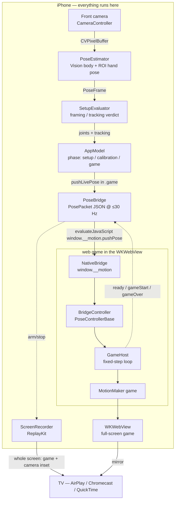

# How Motion works, end to end

Motion turns your body into a game controller. An iPhone watches you with its
front camera, runs Apple **Vision** body-pose detection on-device, and drives a
game rendered full-screen on the phone. You mirror the phone to a TV (AirPlay /
Chromecast / QuickTime) to play on the big screen.

This page traces the **actual shipped v1 code**. For the choices behind it and
the alternatives rejected, see the [decision log](../decision-log.md); for build
state and the on-device verify list, see
[`PROJECT_STATUS.md`](../../PROJECT_STATUS.md).

## v1 is serverless and single-device

The whole game loop lives on one phone: camera, pose ML, the game, and recording.
**No backend, no accounts, no pairing.** The TV is fed by the OS's own screen
mirroring — the app implements no cast code.

The `server/` PartyKit relay, `web/`'s socket transport, and the parked iOS
`Net/` + non-ReplayKit recording files are the **v2** browser/multiplayer path.
They are kept typecheck-green but nothing in the v1 game flow constructs them
(each carries a `PARKED` header; see `ios/.../App/AppModel.swift` and
`server/README.md`). One live exception is described in
[Secondary path: stream to a browser](#secondary-path-stream-to-a-browser).

## The pieces

| Component | File(s) | Role |
|---|---|---|
| Camera + pose ML | `ios/Sources/Motion/Vision/PoseEstimator.swift` | Vision body + ROI hand pose → 8 normalized joints |
| Vision coordinator | `ios/.../App/PoseSession.swift` | wires camera → estimator → setup evaluator → model |
| App state / phase machine | `ios/.../App/AppModel.swift` | `setup → calibration → game`; ingests every frame |
| In-process bridge | `ios/.../Game/PoseBridge.swift` + `web/src/sdk/bridge.ts` | pushes pose into the WKWebView; routes lifecycle back |
| Game host (WKWebView) | `ios/.../Game/GameWebView.swift`, `GameConfig.swift` | full-screen web game surface + load source |
| Wire shapes | `protocol/protocol.ts`, `ios/.../Net/Protocol.swift` | `PosePacket` etc., mirrored Swift ↔ TS |
| SDK / controllers | `web/src/sdk/*` | smoothing, readiness, game loop, `BodyController` |
| The game | `web/src/games/motion-maker/index.ts` | the drop-in `Game` the phone runs |
| Screen recording | `ios/.../Recording/ScreenRecorder.swift` | ReplayKit capture of the whole screen → Photos |

## The data flow



## Frame by frame

### 1. Capture and pose (on-device Vision)

`CameraController` delivers `CVPixelBuffer`s that a `RotationCoordinator` keeps
**display-upright**, so the buffer handed to Vision is never sideways.
`PoseEstimator` runs `VNDetectHumanBodyPoseRequest` on the full frame (~20 Hz,
throttled), then a **second ROI-zoomed pass**: for each wrist it runs a
`VNDetectHumanHandPoseRequest` cropped tightly around that wrist so the hand fills
the frame and yields precise 21-point landmarks (falling back to a full-frame hand
request when a wrist is missing). No custom ML model — Vision ships the landmarks.

The estimator emits the protocol's **8 required joints** (head, hands, torso,
knees, feet) plus optional arm-chain and fingertip data, exponentially smoothed
per joint. Two coordinate corrections are applied and flagged as the **#1
on-device verify item** (`PoseEstimator.swift` header): Vision's origin is
bottom-left so `y' = 1 - y`; and because the camera connection is mirrored
(`isVideoMirrored = true`), Vision's *left* wrist is the player's *right* hand, so
left/right are **swapped** when mapping to protocol joints.

### 2. Setup, tracking, and the phase machine

Each `PoseFrame` flows through `SetupEvaluator` (is the body framed, close/far,
enough light?) into `AppModel.ingest(...)`. `AppModel.phase` is a three-state
machine — `setup → calibration → game` — routed by `ContentView`. A single
`PoseSession` is created once and shared across all phases so the camera is never
torn down.

`AppModel` also runs a pose-only **`ClapDetector`**: outside the game, a clap
(hands together on the closing edge, with hysteresis + debounce) increments
`clapCount`, letting a far-away player "press" Calibrate/Continue without reaching
the screen.

### 3. The in-process bridge (no socket)

This is the heart of the v1 pivot. Instead of streaming pose over a WebSocket to a
browser, the phone injects it into the same-device web game **in process**:

- `PoseBridge.pushLivePose(...)` (called from `AppModel.ingest` only while
  `phase == .game`) encodes a `PosePacket` to JSON and calls
  `coordinator.pushPose(...)`, which runs `evaluateJavaScript` on
  `window.__motion.pushPose(...)`. It throttles to ≤30 Hz and only pushes when
  tracking is `.ok`; tracking-state changes are forwarded immediately (they
  pause/resume the game).
- On the web side, `NativeBridge` (`sdk/bridge.ts`) installs `window.__motion` and
  feeds frames into a **`BridgeController`**. In a plain browser
  `window.webkit.messageHandlers.motion` is absent, so every web→native emit is a
  guarded no-op — the same code runs in a browser and in the WKWebView.

Crucially, `BridgeController` extends the same `PoseControllerBase` as the socket
`PoseController`, so **all control-feel logic is written once**: out-of-order
rejection (`seq <= lastSeq`), per-joint exponential smoothing (`SMOOTH_ALPHA`),
400 ms staleness detection, and derived squat/lean/hand-open gestures. The
transport is the only difference between v1 and v2.

### 4. The game host and loop

Games read **only** the `BodyController` interface (`sdk/controller.ts`) — never
raw packets — so smoothing and stale-rejection are inherited. `GameHost`
(`sdk/index.ts`) owns a `requestAnimationFrame` loop with **fixed-timestep
updates** (`STEP_MS = 1000/60`, up to 5 catch-up steps) and frame-time rendering.

In bridge mode there is no room, no pairing, no readiness ceremony on the web
side: the host starts in a `bridge-idle` screen and flips to `game` when native
calls `start()` (fired on the web's `ready` event), or self-advances via a
`BRIDGE_IDLE_FALLBACK_MS` timeout / first usable input so the phone can never
deadlock on a blank surface. If the body goes stale, the loop pauses the game
within ~1 s.

### 5. Which game runs

`web/src/app/main.ts` selects the game: **whenever the transport is `bridge`
(i.e. the phone hosts it) it runs `MotionMaker`**, an upper-body-friendly
playground where you grab, move, and toss floating objects into a bin (grab =
close a hand near an object; release = open it, with a proximity-dwell fallback
when no hand-openness data is present). Classic *Reach & Dodge*
(`games/reach-dodge/`) remains only for the plain-browser socket default. (The
earlier docs' "v1 game is Reach & Dodge" is stale — the current HEAD switched the
on-phone game to Motion Maker.)

### 6. Recording and the TV

Recording in v1 is **ReplayKit only**. `ScreenRecorder` captures the whole app
screen — the WKWebView game *and* the small camera-preview inset composited on top
— into one MP4 via `AVAssetWriter`, then saves to Photos. It's armed by an
on-screen toggle and bracketed by the web `gameStart` / `gameOver` events routed
through `PoseBridge`. No MediaRecorder, no clip transfer, no compositing step.
The single biggest on-device unknown (flagged in the file header) is **whether
ReplayKit captures WKWebView out-of-process web content** — with documented
fallbacks (native HUD, or `.bundled` file:// load).

The TV picture is just the phone's screen, mirrored by the OS. `GameConfig`
chooses where the WKWebView loads from: the Vite **dev server** for the fast
iterate loop, or a **bundled** `webgame/` folder (`loadFileURL`) for a
self-contained app with no Mac/network — `GameConfig.source` auto-prefers the
bundle when it ships.

## Secondary path: stream to a browser

`AppModel` also exposes a `streamToWebsite` toggle that opens a `RoomSocket`
(`ios/.../Net/RoomSocket.swift`) to the PartyKit relay and streams every pose
(with hands) to `ws://<devServerIP>:1999/parties/main/<roomCode>`, so a browser
`display` can render the phone's motion live. This runs **independently of and in
addition to** the local WKWebView game (it streams straight from `setup`, not
gated on the full-body `.ok` state). It is a live preview of the v2 relay path,
wired today; the local game does not depend on it.

## Key decisions, in one line each

Full rationale + rejected alternatives live in the
[decision log](../decision-log.md). The load-bearing ones:

- **Phone does the ML.** Vision runs on-device; only ~8 normalized joints ever
  leave the pose stage — **camera frames never leave the phone**.
- **Serverless single-device v1.** The product risk is *control feel*, not
  infrastructure, so v1 removes every server and network hop.
- **Transport behind an abstraction.** `bridge` (in-process, v1) and `socket`
  (PartyKit, v2) share `PoseControllerBase`, so v2 is a transport swap, not a
  rearchitecture.
- **Reusable SDK; a game is a drop-in.** Games touch only `BodyController` +
  `Renderer`; the SDK owns smoothing, readiness, loop, and recording.
- **Keyboard/mouse debug controller is first-class** (`?debug=1`, press `d`), so
  control feel is iterable without a phone.
- **iOS shipped as source + XcodeGen**, not a checked-in `.xcodeproj`.

## Try it

The game is playable in a desktop browser with no phone:

```bash
npm install
npm --workspace web run dev   # http://localhost:5173/?debug=1
```

`?debug=1`: mouse = hands, arrow keys = lean, space = squat. To run on a phone,
see the [README](../../README.md).
